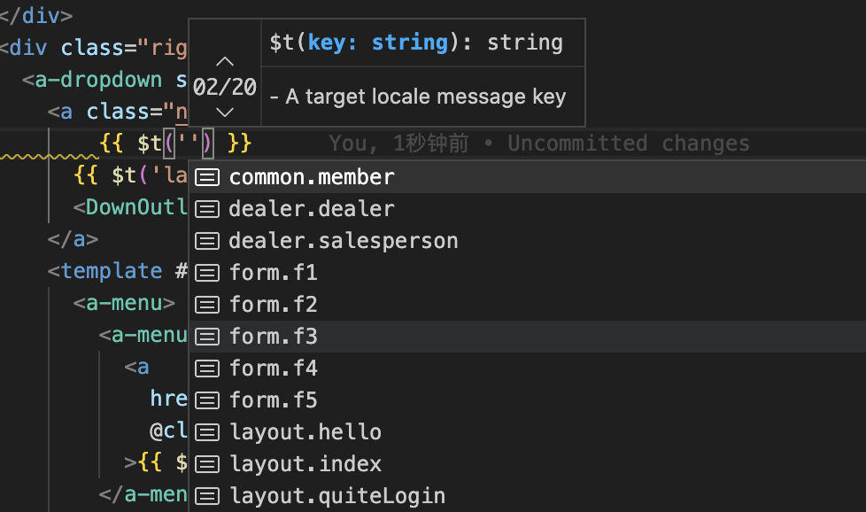
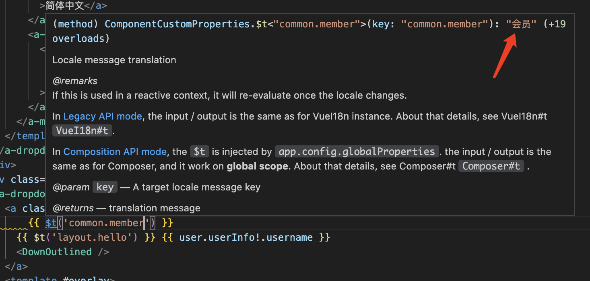

---
title: 编写 vite 插件自动生成 i18n 类型提示  
category: practice  
---  

## 编写 vite 插件自动生成 i18n 类型提示  

### 最终效果  
`编写时候的参数智能提示`：  



`鼠标移动上去看到中文注释`:  




### 思路  

编写 vite 插件自动监听 i18n 配置文件变化，自动生成类型声明文件  

### 实现  

`测试环境:`
- "vite": "^4.3.4",
- "vue": "^3.3.4"
- "node":"16+"

```javascript
import fs from 'node:fs'
import path from 'node:path'
const targetDir = './src/i18n'
const regExp = /const\s*cn\s*=\s*\{[^}]*\}/gm
export default function definePlugin() {
  return {
    name: 'i18nTypeGen',
    apply: 'serve', // 默认情况下插件在开发（serve）和构建（build）模式中都会调用 这里指定开发环境
    handleHotUpdate({ file,read }) {
      if(file.includes('src/i18n')){
        console.log('i18n file changed')
        read().then(res=>{
          const files = fs.readdirSync(targetDir);
          let resObj = {}
          files.forEach(file=>{
            const filePath = path.join(targetDir, file);
            const content = fs.readFileSync(filePath, 'utf-8');
            const matchResult = content.match(regExp)
            if(matchResult){
              const res = new Function(matchResult[0]+'\n'+'return cn')()
              const keys = Object.keys(res)
              if(keys.length){
                Object.assign(
                  resObj,
                  Object.keys(res).reduce((a,b)=>{
                    a[`${file.replace(/\.[^.]+/,'')}.${b}`] = res[b]
                    return a
                  },{})
                )
              }
            }
          })
          insert(resObj)
        })
      }
    }
  }
}


const insert = (resObj)=>{
  fs.writeFileSync('./i18nTips.d.ts', 
    `
/* eslint-disable */
/* prettier-ignore */
// @ts-nocheck
// 自动生成i18n的$t类型 助力写入参的提示
import '@vue/runtime-core'

export {}

declare module '@vue/runtime-core' {
export interface ComponentCustomProperties{
  $t<T extends keyof I18nTempType>(key:T):I18nTempType[T]
}
}

export type I18nTempType = ${JSON.stringify(resObj)}
    `
  );
}

```

### 缺陷  

出于性能以及实现难度考虑，使用了正则匹配配置文件的具体代码，所以配置文件需要按照约定编写  

例如：  

```javascript

// 一个模块 比如叫common.ts
const en = {
  member:'member',
}

const cn = {
  member:'会员'
}

export default {
  en,cn
}

// i18n主文件 index.ts
import { createI18n } from 'vue-i18n'
import common from './common'
const modules = {
  common,
}
export const messages = {
  ...Object.keys(modules).reduce((a,b)=>{
    const langs = Object.keys(modules[b])
    langs.forEach(it=>{
      a[it] = {
        ...a[it],
        [b]:modules[b][it]
      }
    })
    return a
  },{})
}

export const i18n = createI18n({
  locale: 'cn', // set locale
  fallbackLocale: 'en', // set fallback locale
  messages, // set locale messages
  legacy: false,
})

// 如果common.js发生变化 将会生成i18nTips.d.ts:
import '@vue/runtime-core'
export {}

declare module '@vue/runtime-core' {
export interface ComponentCustomProperties{
  $t<T extends keyof I18nTempType>(key:T):I18nTempType[T]
}
}
export type I18nTempType = {"common.member":"会员"}

// $t有了提示 但是在javaScript文件中 我们使用i18n.global.t进行转译  
// 所以在 i18n主文件index.ts可以加上,然后在其他文件引入jst进行翻译就行了  
import type { I18nTempType } from '../../i18nTips'
export const jst = i18n.global.t as <T extends keyof I18nTempType>(key:T)=>I18nTempType[T]

```

### vue2.7 的兼容

只需要修改输出类型文件的编码方式:

```javascript
import fs from 'node:fs'
import path from 'node:path'
const targetDir = './src/i18n'
const regExp = /const\s*cn\s*=\s*\{[^}]*\}/gm
export default function definePlugin() {
  return {
    name: 'i18nTypeGen',
    apply: 'serve', // 默认情况下插件在开发（serve）和构建（build）模式中都会调用 这里指定开发环境
    handleHotUpdate({ file,read }) {
      if(file.includes('src/i18n')){
        console.log('i18n file changed')
        read().then(res=>{
          const files = fs.readdirSync(targetDir);
          const resObj = {}
          files.forEach(file=>{
            const filePath = path.join(targetDir, file);
            const content = fs.readFileSync(filePath, 'utf-8');
            const matchResult = content.match(regExp)
            if(matchResult){
              const res = new Function(matchResult[0]+'\n'+'return cn')()
              const keys = Object.keys(res)
              if(keys.length){
                Object.assign(
                  resObj,
                  Object.keys(res).reduce((a,b)=>{
                    a[`${file.replace(/\.[^.]+/,'')}.${b}`] = res[b]
                    return a
                  },{})
                )
              }
            }
          })
          insert(resObj)
        })
      }
    }
  }
}


const insert = (resObj)=>{
  fs.writeFileSync('./i18nTips.d.ts', 
    `
/* eslint-disable */
/* prettier-ignore */
// @ts-nocheck
// 自动生成i18n的$t类型 助力写入参的提示

import Vue from 'vue';

export {}

declare module 'vue/types/vue' {
    interface Vue {
        $t<T extends keyof I18nTempType>(key:T):I18nTempType[T]
    }
}

export type I18nTempType = ${JSON.stringify(resObj)}
    `
  );
}
```

### tsconfig

::: tip
注意:不管是vue2还是vue3 tsconfig.json 必须配置:
```javascript
{
  "compilerOptions": {
    "skipLibCheck": true,
  },
}
```
这并不意味着 skipLibCheck 选项会完全禁用 node_modules 中的所有类型声明。实际上，只有当你在自己的代码中重新定义了某个 node_modules 中已有的类型声明时，这个选项才会生效。如果你在自己的代码中使用了 node_modules 中的类型声明，而这些类型声明没有被重新定义，那么这些类型声明仍然会被 TypeScript 编译器所检查，并且能够影响你的代码编译和运行。
:::